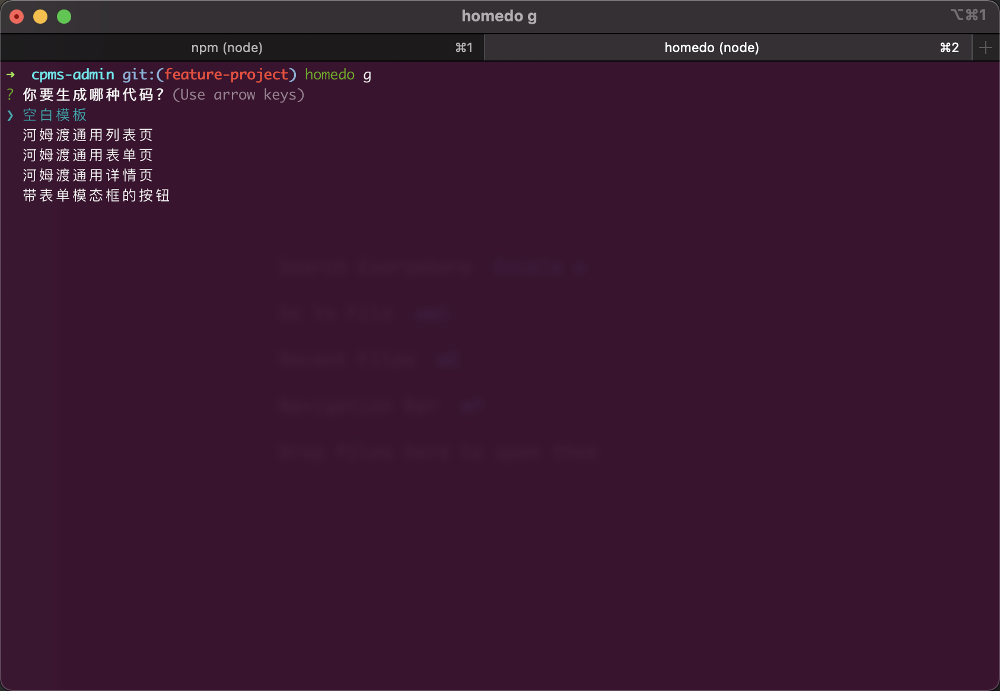

# homedo-cli



⚠️⚠️ 功能开发中... ⚠️⚠️

一个半自动化代码生成工具, 用于加快前端的研发速度, 由河姆渡浦东研发中心开发和维护

## 如何使用
全局安装 `homedo-cli` 后, 你会得到 `homedo` 这个全局命令

```bash
sudo npm i -g homedo-cli
```

## 命令清单
可以通过 `homedo --help` 查看命令清单

1. 初始化仓库, 目前仅支持 vue3, 模板来自 [homedo-vue3-boilerplate](https://github.com/rmlzy/homedo-vue3-boilerplate)

```bash
homedo new my-new-project
```

2. 生成组件

```bash
homedo generate

# 也可以使用别名
homedo g
```

## 加速三件套
+ [homedo-vue3-boilerplate](https://github.com/rmlzy/homedo-vue3-boilerplate): 一个模板仓库
+ [homedo-cli](https://github.com/rmlzy/homedo-cli): 一个生成代码的终端命令
+ [homedo-utils](https://github.com/rmlzy/homedo-utils): 河姆渡常用的公共方法

如果对你有帮助, 欢迎点一下 Star

如果有问题, 可以通过 rmlzy@outlook.com 找到我

## LICENSE
MIT

